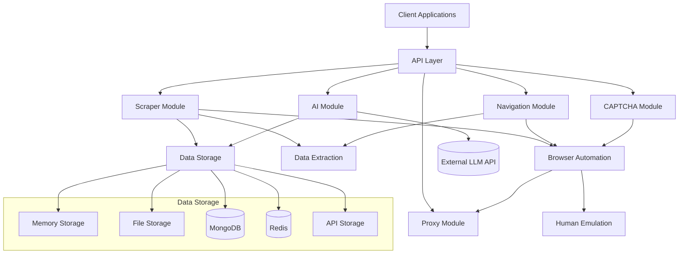

# Advanced Web Scraper API Documentation

Welcome to the Advanced Web Scraper API documentation. This documentation provides detailed information about the various components and features of the API.

## Table of Contents

- [Domain Documentation](domains/README.md): Organized by functional domains
- [API Reference](api/README.md): Detailed API reference for all endpoints.
  - [Queue System API](api/queue-system.md): Understanding asynchronous job handling and status checks.
- [Navigation Module](navigation/README.md): Documentation for multi-step navigation flows.
  - [Navigation Step Types](navigation/navigation-types.md): Details on available step types.
  - [Navigation Examples](navigation/navigation_examples.md): Practical examples of navigation configurations.
- [Extraction Module](extraction/README.md): Documentation for data extraction strategies.
  - [Regex Extraction](extraction/regex-extraction.md): Using regular expressions for extraction.
- [Storage Module](storage/README.md): Documentation for the storage module, including adapters.
- [Session Management](sessions/session-management.md): Managing persistent scraping sessions.
  - [Browser Configuration](sessions/browser-configuration.md): Configuring browser settings for sessions.
  - [Proxy Configuration](sessions/proxy-configuration.md): Configuring and using proxies.
  - [Storage Adapters Comparison](sessions/storage-adapters.md): Comparing session storage options.
- [AI Features](ai/README.md): Documentation for AI-powered capabilities.
  - [AI Configuration Generation](ai/README.md): Generating configurations from prompts.
- [Deployment Guides](deployment.md): General deployment instructions using Docker.
  - [Coolify Deployment](coolify-deployment.md): Specific guide for deploying with Coolify.
- [Configuration](configuration.md): Configuration options and environment variables (coming soon).
- [Examples](examples.md): Examples of common use cases (coming soon).

## Architecture

The Advanced Web Scraper API follows a modular monolith architecture with clear boundaries between components. This approach provides the benefits of a microservices architecture (separation of concerns, independent development) while avoiding the complexity of distributed systems during initial development.

### High-Level Architecture

## Core Components

The Advanced Web Scraper API consists of the following core components:

1. **API Layer**: Handles HTTP requests and responses, manages authentication and authorization, implements rate limiting and request validation, and routes requests to appropriate modules.

2. **Scraper Module**: Coordinates the scraping process, manages browser instances, handles data extraction and transformation, and stores results in the database.

3. **Navigation Module**: Implements multi-step navigation flows, manages state during navigation, handles pagination and crawling, and executes conditional logic.

4. **CAPTCHA Module**: Detects various types of CAPTCHAs, implements solving strategies, integrates with external solving services, and manages token application.

5. **Proxy Module**: Manages a pool of proxies, implements rotation strategies, monitors proxy health and performance, and handles authentication and session management.

6. **Browser Automation**: Controls browser instances, manages browser contexts and pages, implements stealth techniques, and handles resource optimization.

7. **Human Emulation**: Simulates human-like behavior, implements realistic mouse movements, creates variable timing patterns, and adds randomization to interactions.

8. **Data Extraction**: Implements various selector strategies, extracts structured data from pages, transforms and cleans extracted data, and validates against schemas.

9. **Data Storage**: Provides a flexible and extensible system for storing, retrieving, updating, and deleting extraction results, with support for multiple storage destinations.

10. **AI Module**: (New) Handles interactions with Large Language Models (LLMs) to provide features like configuration generation from natural language prompts.

## Getting Started

For information on how to get started with the Advanced Web Scraper API, please refer to the [main README](../README.md) file.

## Contributing

Contributions to the Advanced Web Scraper API are welcome. Please refer to the [contributing guidelines](../CONTRIBUTING.md) for more information.

## License

This project is licensed under the MIT License - see the [LICENSE](../LICENSE) file for details.
