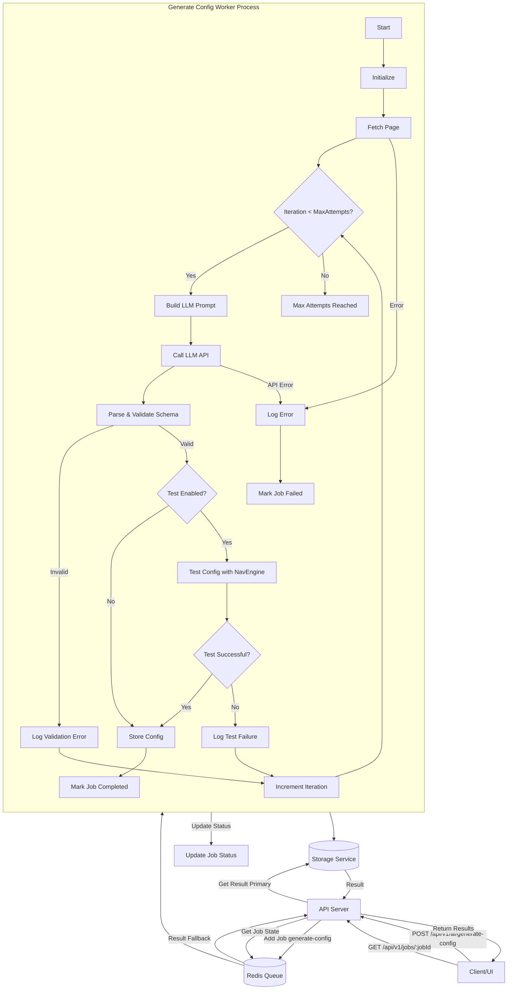

# AI Features Documentation

This section covers the AI-powered features available in the Advanced Web Scraper API.

## LLM Integration

The API integrates with multiple language model providers through OpenRouter, providing a unified interface for AI-powered features.

### Supported Models

The system supports a wide range of models through OpenRouter:

- **OpenAI Models**
  - GPT-4o
  - GPT-4o-mini
  - GPT-4.1-mini
  - GPT-4
  - GPT-3.5-turbo

- **DeepSeek Models**
  - DeepSeek Reasoner
  - DeepSeek Chat

- **Anthropic Models**
  - Claude-3-7-Sonnet
  - Claude-3-5-Sonnet

- **Google Models**
  - Gemini 2.5 Pro

### Model Costs

The system tracks token usage and costs for each model:

```typescript
// Example cost structure
const MODEL_COSTS = {
  'gpt-4o': {
    input: 0.0025 / 1000,  // $2.50 per 1M tokens
    output: 0.01 / 1000,   // $10.00 per 1M tokens
  },
  'gpt-4o-mini': {
    input: 0.00015 / 1000, // $0.15 per 1M tokens
    output: 0.0006 / 1000, // $0.60 per 1M tokens
  },
  // ... other model costs
};
```

### Configuration

To use the LLM features, configure the following environment variables:

```bash
# LLM Configuration
OPENROUTER_API_KEY=your_openrouter_api_key
OPENROUTER_MODEL=openai/gpt-3.5-turbo  # Default model
```

### Usage Example

```typescript
// Example: Using the OpenRouter adapter
const llmAdapter = new OpenRouterAdapter({
  apiKey: process.env.OPENROUTER_API_KEY,
  model: 'openai/gpt-3.5-turbo',  // Optional, defaults to env var
  temperature: 0.7,              // Optional
  maxTokens: 1000,               // Optional
});

// Make a completion request
const response = await llmAdapter.complete({
  prompt: 'Your prompt here',
  model: 'anthropic/claude-2',   // Optional, overrides default
  temperature: 0.8,              // Optional, overrides default
});
```

## AI Configuration Generation

This feature allows you to generate complex web scraping configurations automatically by providing a target URL and a natural language prompt describing the desired data and navigation steps.

### Purpose

- **Simplify Configuration**: Reduces the effort required to manually create detailed JSON configuration files.
- **Lower Barrier to Entry**: Enables users less familiar with CSS selectors or scraping logic to define scraping tasks.
- **Accelerate Development**: Quickly generates a starting configuration that can be tested and refined.

### Workflow

The AI configuration generation process works asynchronously using the API's queue system:

1. **API Request**: The client sends a `POST` request to `/api/v1/ai/generate-config` with the target `url` and a natural language `prompt`. Optional `options` can be provided to control the generation process (e.g., `maxIterations`, `testConfig`, `interactionHints`).
2. **Job Queuing**: The API server validates the request and adds a job to the `config-generation-jobs` queue. It immediately returns a `jobId` and a `statusUrl` (`/api/v1/jobs/:jobId`).
3. **Worker Processing**: A dedicated worker (`generate-config-worker.ts`) picks up the job from the queue, including any provided `interactionHints`.
4. **Initial Generation**: The worker calls the `AiService` to interact with an LLM, providing the URL, prompt, potentially HTML context, and any `interactionHints`, to generate the initial JSON configuration. The hints help guide the LLM, especially for pages requiring interaction to reveal content.
5. **Validation**: The worker validates the structure of the AI-generated JSON using a Zod schema. If invalid, it logs the error and may attempt a fix in the next iteration.
6. **Testing (Optional)**: If the `testConfig` option is enabled (default: true), the worker launches a browser instance and uses the `NavigationEngine` to execute the generated configuration against the target URL.
7. **Evaluation**: The worker evaluates the test run. Success is typically defined as the flow completing without errors and extracting some data.
8. **Fixing Loop (If Testing Fails)**: If validation or testing fails, the worker calls the `AiService` again, providing the previous configuration, the error details, and the original `interactionHints`. The AI attempts to generate a corrected configuration. This loop repeats up to `maxIterations` (default: 3).
9. **Completion/Failure**:
    * If a configuration passes validation and testing (or if testing is disabled), the job is marked as `completed`. The final configuration is stored using the `StorageService` (accessible via the job status endpoint).
    * If the process fails after `maxIterations`, the job is marked as `failed`, and the last error is recorded.
10. **Status Tracking**: The client can poll the `statusUrl` (`GET /api/v1/jobs/:jobId`) to track the job's progress (e.g., `generating`, `testing`, `fixing`, `completed`, `failed`), view token usage/cost estimates, and retrieve the final configuration upon completion.

### Workflow Diagram



### API Usage

See [AI API Documentation](../api/ai-api.md) for details on the `/api/v1/ai/generate-config` endpoint.

### Current Status & Limitations

- The backend foundation is implemented with support for multiple LLM providers via adapters (`src/core/ai/llm-adapters/`). The system dynamically routes requests to the correct provider adapter based on the requested model name.
- Any model supported by the respective provider's API (and compatible with the adapter's implementation) can potentially be used by specifying its name in the request, provided the provider's API key is configured.
- Adapters use standard `fetch` (Anthropic) or `axios` (DeepSeek, OpenAI, OpenRouter) for API calls.
- The DeepSeek adapter no longer forces JSON output (`response_format`) due to potential compatibility issues; it relies on the model following prompt instructions to return JSON. Error handling is added for non-JSON responses.
- Prompt engineering may require further refinement for optimal results across various websites, prompts, and models.
- The testing success criteria within the worker are currently basic (no errors, some data extracted) and could be enhanced.
- Zod schema validation could be made more detailed to catch finer structural issues.
