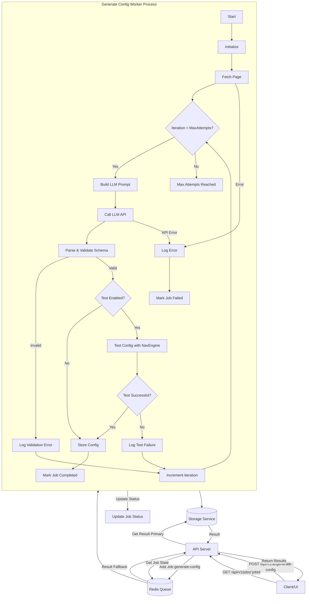

# AI Features Documentation

This section covers the AI-powered features available in the Advanced Web Scraper API.

## AI Configuration Generation

This feature allows you to generate complex web scraping configurations automatically by providing a target URL and a natural language prompt describing the desired data and navigation steps.

### Purpose

- **Simplify Configuration**: Reduces the effort required to manually create detailed JSON configuration files.
- **Lower Barrier to Entry**: Enables users less familiar with CSS selectors or scraping logic to define scraping tasks.
- **Accelerate Development**: Quickly generates a starting configuration that can be tested and refined.

### Workflow

The AI configuration generation process works asynchronously using the API's queue system:

1.  **API Request**: The client sends a `POST` request to `/api/v1/ai/generate-config` with the target `url` and a natural language `prompt`. Optional `options` can be provided to control the generation process (e.g., `maxIterations`, `testConfig`).
2.  **Job Queuing**: The API server validates the request and adds a job to the `config-generation-jobs` queue. It immediately returns a `jobId` and a `statusUrl` (`/api/v1/jobs/:jobId`).
3.  **Worker Processing**: A dedicated worker (`generate-config-worker.ts`) picks up the job from the queue.
4.  **Initial Generation**: The worker calls the `AiService` to interact with an LLM, providing the URL, prompt, and potentially HTML context, to generate the initial JSON configuration.
5.  **Validation**: The worker validates the structure of the AI-generated JSON using a Zod schema. If invalid, it logs the error and may attempt a fix in the next iteration.
6.  **Testing (Optional)**: If the `testConfig` option is enabled (default: true), the worker launches a browser instance and uses the `NavigationEngine` to execute the generated configuration against the target URL.
7.  **Evaluation**: The worker evaluates the test run. Success is typically defined as the flow completing without errors and extracting some data.
8.  **Fixing Loop (If Testing Fails)**: If validation or testing fails, the worker calls the `AiService` again, providing the previous configuration and the error details. The AI attempts to generate a corrected configuration. This loop repeats up to `maxIterations` (default: 3).
9.  **Completion/Failure**:
    *   If a configuration passes validation and testing (or if testing is disabled), the job is marked as `completed`. The final configuration is stored using the `StorageService` (accessible via the job status endpoint).
    *   If the process fails after `maxIterations`, the job is marked as `failed`, and the last error is recorded.
10. **Status Tracking**: The client can poll the `statusUrl` (`GET /api/v1/jobs/:jobId`) to track the job's progress (e.g., `generating`, `testing`, `fixing`, `completed`, `failed`), view token usage/cost estimates, and retrieve the final configuration upon completion.

### Workflow Diagram

### API Usage

See [AI API Documentation](../api/ai-api.md) for details on the `/api/v1/ai/generate-config` endpoint.

### Configuration

- API keys for the desired LLM services must be provided via environment variables:
    - OpenAI: `OPENAI_API_KEY`
    - DeepSeek: `DEEPSEEK_API_KEY`
    - Anthropic: `ANTHROPIC_API_KEY`
- See `src/config/index.ts` for the `ai` configuration section, which includes optional keys for `openai`, `deepseek`, and `anthropic`.
- The desired model (e.g., `'gpt-4o-mini'`, `'deepseek-reasoning'`, `'claude-3-5-sonnet-20240620'`) can be specified in the `options.model` field of the `/api/v1/ai/generate-config` request. If not specified, it defaults to the model defined in `src/core/ai/ai-service.ts` (`gpt-4o-mini`).

### Current Status & Limitations

- The backend foundation is implemented with support for multiple LLM providers via adapters (`src/core/ai/llm-adapters/`).
- Currently supported models include:
    - OpenAI: `gpt-4o-mini` (default), others via `OpenAIAdapter`.
    - DeepSeek: `deepseek-reasoning` via `DeepSeekAdapter`.
    - Anthropic: `claude-3-5-sonnet-20240620` via `AnthropicAdapter`.
- Adapters use standard `fetch` for API calls.
- Prompt engineering may require further refinement for optimal results across various websites and prompts.
- The testing success criteria within the worker are currently basic (no errors, some data extracted) and could be enhanced.
- Zod schema validation could be made more detailed to catch finer structural issues.
