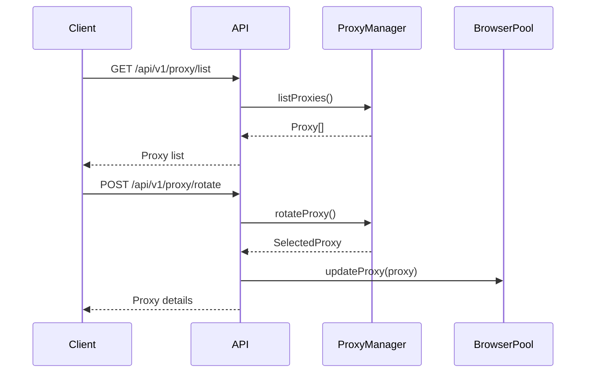

# Proxy API Documentation

The Proxy API provides endpoints for managing and interacting with the proxy pool used by the web scraper.

## Base URL
All endpoints are prefixed with `/api/v1/proxy`

## Proxy Management Flow



## Endpoints

### GET /list
Get a list of all available proxies with optional filtering.

**Query Parameters:**
- `type` - Filter by protocol (http, https, socks4, socks5)
- `country` - Filter by country code (e.g. "US", "GB")
- `city` - Filter by city (e.g. "New York")  
- `region` - Filter by region (e.g. "Europe")
- `asn` - Filter by ASN
- `anonymityLevel` - Filter by anonymity level
- `minSpeed` - Minimum speed requirement (in Mbps)
- `maxLatency` - Maximum allowed latency (in ms)
- `minUpTime` - Minimum uptime percentage
- `minSuccessRate` - Minimum internal success rate (0-1)

**Example Request:**
```bash
curl "http://localhost:3000/api/v1/proxy/list?country=US&type=https&minSuccessRate=0.8"
```

**Example Response:**
```json
{
  "success": true,
  "count": 42,
  "proxies": [
    {
      "ip": "192.168.1.1",
      "port": 8080,
      "protocols": ["http", "https"],
      "country": "US",
      "city": "New York",
      "latency": 120,
      "upTime": 99.5,
      "successRate": 0.85,
      "lastUsed": "2025-04-13T08:30:00Z"
    }
  ]
}
```

### GET /stats
Get statistics about available proxies.

**Response:**
```json
{
  "success": true,
  "data": {
    "total": 100,
    "healthy": 85,
    "byProtocol": {
      "http": 60, 
      "https": 40
    },
    "byCountry": {
      "US": 50,
      "UK": 30,
      "DE": 20
    },
    "avgLatency": 150,
    "avgResponseTime": 200,
    "avgUpTime": 95.5
  }
}
```

### POST /test
Test a specific proxy.

**Request Body:**
```json
{
  "ip": "192.168.1.1",
  "port": 8080,
  "type": "http",
  "username": "user1",
  "password": "pass123"
}
```

**Response:**
```json
{
  "success": true,
  "data": {
    "latency": 120,
    "success": true,
    "error": null
  }
}
```

### POST /rotate
Get a new proxy with optional targeting.

**Request Body:**
```json
{
  "type": "https",
  "country": "US",
  "city": "New York",
  "minSuccessRate": 0.8,
  "sessionId": "session123" // Optional session binding
}
```

**Response:**
```json
{
  "success": true,
  "data": {
    "ip": "192.168.1.2",
    "port": 3128,
    "protocols": ["https"],
    "country": "US",
    "city": "New York",
    "latency": 100,
    "upTime": 99.8,
    "sessionId": "session123"
  }
}
```

### POST /clean
Clean the proxy list by removing invalid proxies.

**Response:**
```json
{
  "success": true,
  "removedCount": 15,
  "remainingCount": 85
}
```

## Error Responses

All endpoints return standardized error responses:

```json
{
  "success": false,
  "message": "Error description",
  "error": "Detailed error message"
}
```

Common status codes:
- 400 - Bad request (validation errors)
- 404 - Not found (no proxies available)
- 500 - Internal server error

## Best Practices

1. **Session Binding**: Use `sessionId` when rotating proxies to maintain consistency
2. **Health Monitoring**: Regularly test and clean proxies
3. **Geotargeting**: Match proxy locations to target sites
4. **Protocol Matching**: Use HTTPS proxies for HTTPS sites
5. **Rate Limiting**: Avoid rapid proxy rotation to prevent bans
