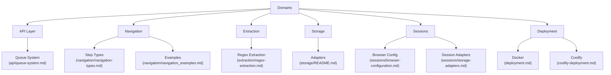

# Advanced Web Scraper API - Domain Documentation

This documentation organizes the API's functionality by core domains, providing a structured way to understand and work with the system.

## Core Domains

### API Layer Domain
- [Queue System](api/queue-system.md) - Asynchronous job handling
- [API Reference](../README.md#api-reference) - Main API documentation

### Navigation Domain
- [Navigation Types](navigation/navigation-types.md) - Available step types
- [Navigation Examples](navigation/navigation_examples.md) - Practical configurations

### Extraction Domain  
- [Regex Extraction](extraction/regex-extraction.md) - Pattern-based data extraction
- [Selector Strategies](../README.md#data-extraction) - Various extraction methods

### Storage Domain
- [Storage Adapters](storage/README.md) - Supported storage backends
- [Adapter Comparison](sessions/storage-adapters.md) - Performance characteristics

### Session Domain
- [Browser Configuration](sessions/browser-configuration.md) - Browser setup options  
- [Session Management](sessions/session-management.md) - Persistent session handling

### Deployment Domain
- [Docker Deployment](deployment.md) - Standard container deployment
- [Coolify Deployment](coolify-deployment.md) - Platform-as-a-service setup

## Cross-Domain Features

For architecture overview and cross-domain interactions, see the [main documentation](../README.md#architecture).
