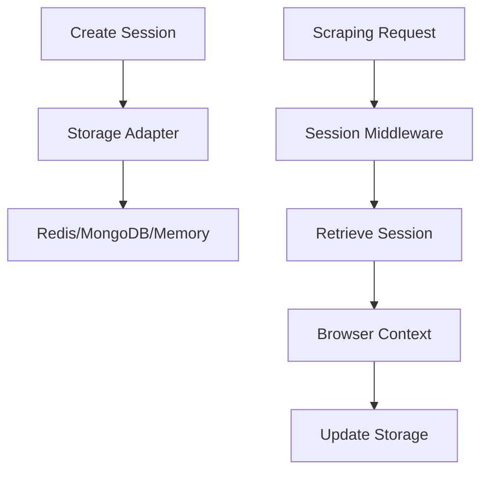

# Session Management

## Overview
The Advanced Web Scraper API provides robust session management to maintain state across multiple scraping requests. Sessions preserve:
- Authentication cookies
- Browser contexts
- Temporary storage
- Rate limit counters



## Configuration
Default session settings from `src/config/index.ts`:
```typescript
export const SESSION_CONFIG = {
  defaultTTL: 1800, // 30 minutes
  cleanupInterval: 300, // 5 minutes
  maxActiveSessions: 100,
  adapters: ['memory', 'redis', 'mongodb']
};
```

## API Usage

### Create Session
```bash
curl -X POST http://localhost:3001/api/v1/sessions \
  -H "Content-Type: application/json" \
  -d '{
    "adapter": "redis",
    "ttl": 3600,
    "browser": {
      "userAgent": "Custom Agent",
      "viewport": {"width": 1280, "height": 800}
    }
  }'
```

### Use Session
```javascript
const response = await fetch('/api/scrape', {
  method: 'POST',
  headers: {
    'X-Session-ID': 'session_id_here',
    'Content-Type': 'application/json'
  },
  body: JSON.stringify({ url: 'https://example.com' })
});
```

## Storage Adapters
| Adapter   | Best For              | Persistence | Performance |
|-----------|-----------------------|-------------|-------------|
| Memory    | Development/Testing   | No          | High        |
| Redis     | Production            | Yes         | Very High   |
| MongoDB   | Complex Session Data  | Yes         | Medium      |

[Learn more about storage adapters](./storage-adapters.md)

## Session Management

### Delete Session
```bash
curl -X DELETE http://localhost:3001/api/v1/sessions/{session_id}
```

### Clear All Sessions
```bash
curl -X DELETE http://localhost:3001/api/v1/sessions
```

## Troubleshooting
Common issues:
- **Session not persisting**: Verify storage adapter is running
- **Browser context lost**: Check session TTL configuration
- **Cookie issues**: Ensure proper domain settings
