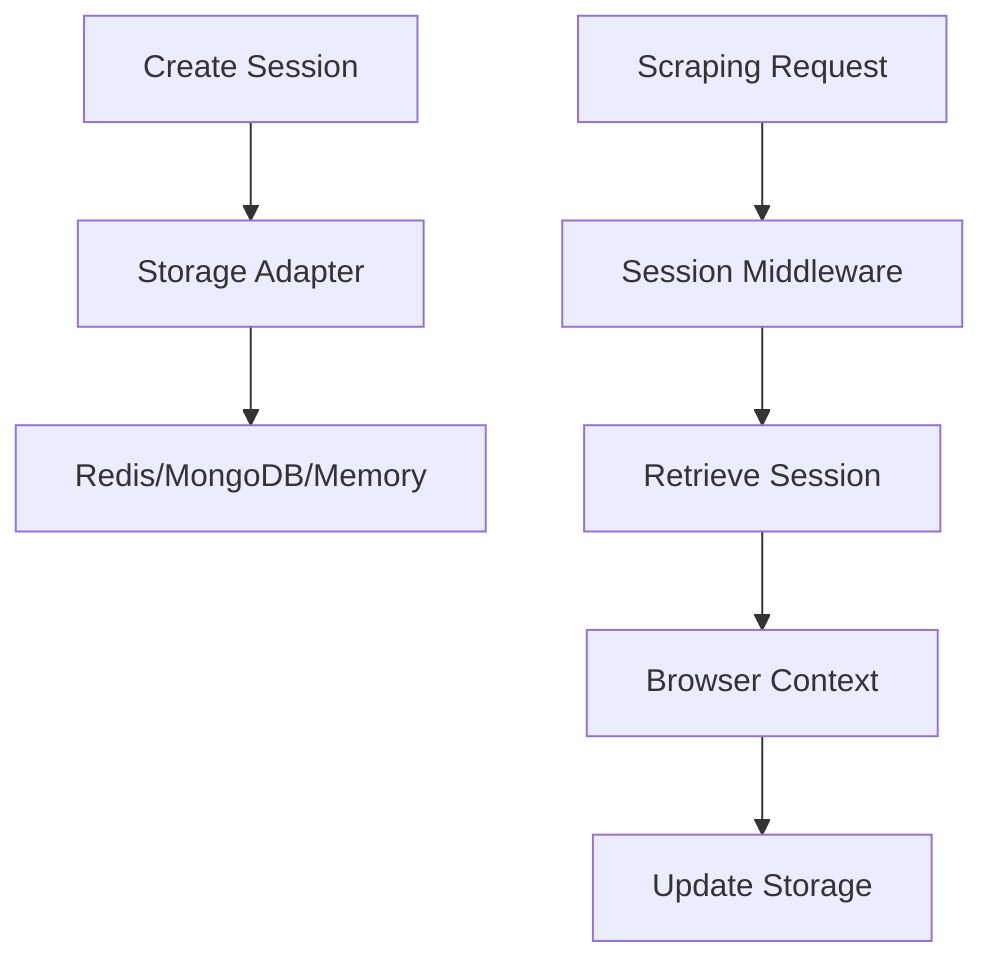

# Session Management

## Overview
The Advanced Web Scraper API provides robust session management to maintain state across multiple scraping requests. Sessions preserve:
- Authentication cookies
- Browser contexts
- Temporary storage
- Rate limit counters

**Note:** By default, browser contexts created for sessions will automatically include a `Referer: https://www.google.com/` header (configurable via the `DEFAULT_REFERER` environment variable) to simulate traffic originating from Google search.



## Configuration
Default session settings from `src/config/index.ts`:
```typescript
export const SESSION_CONFIG = {
  defaultTTL: 1800, // 30 minutes
  cleanupInterval: 300, // 5 minutes
  maxActiveSessions: 100,
  adapters: ['memory', 'redis', 'mongodb']
};
```

## API Usage

### Create Session
```bash
curl -X POST http://localhost:3001/api/v1/sessions \
  -H "Content-Type: application/json" \
  -d '{
    "adapter": "redis",
    "ttl": 3600,
    "browser": {
      "userAgent": "Custom Agent",
      "viewport": {"width": 1280, "height": 800}
    }
  }'
```

### Use Session
```javascript
const response = await fetch('/api/scrape', {
  method: 'POST',
  headers: {
    'X-Session-ID': 'session_id_here',
    'Content-Type': 'application/json'
  },
  body: JSON.stringify({ url: 'https://example.com' })
});
```

### Use Session with Navigation
To utilize an existing session for a navigation task, include the session ID in the `X-Session-ID` header of your request to the `/api/v1/navigate` endpoint.

```bash
curl -X POST http://localhost:3001/api/v1/navigate \
  -H "Content-Type: application/json" \
  -H "X-Session-ID: your_session_id_here" \
  -d '{
    "startUrl": "https://example.com",
    "steps": [
      {
        "type": "wait",
        "value": 1000
      },
      {
        "type": "extract",
        "name": "pageTitle",
        "selector": "title",
        "description": "Extract page title"
      }
    ]
  }'
```

This request will execute the navigation steps within the context of the specified session, leveraging its cookies, local storage, and browser settings.

**Overriding Browser Settings per Navigation:**

You can also provide specific browser settings for a single navigation job by including a `browserOptions` object in the request body. This allows overriding defaults like the `User-Agent` or setting specific headers like `Referer` for just this job.

```bash
curl -X POST http://localhost:3001/api/v1/navigate \
  -H "Content-Type: application/json" \
  -H "X-Session-ID: your_session_id_here" \
  -d '{
    "startUrl": "https://specific-site.com",
    "browserOptions": {
      "userAgent": "MyCustomAgent/1.0",
      "extraHTTPHeaders": {
        "Referer": "https://specific-site.com/previous-page",
        "X-Custom-Header": "SomeValue"
      }
    },
    "steps": [
      { "type": "screenshot", "name": "landing" }
    ]
  }'
```

The `browserOptions` object accepts fields like `userAgent`, `viewport`, `proxy`, and `extraHTTPHeaders`. Headers in `extraHTTPHeaders` will be merged with (and potentially override) the global default headers (like the default `Referer`).

## Storage Adapters
| Adapter   | Best For              | Persistence | Performance |
|-----------|-----------------------|-------------|-------------|
| Memory    | Development/Testing   | No          | High        |
| Redis     | Production            | Yes         | Very High   |
| MongoDB   | Complex Session Data  | Yes         | Medium      |

[Learn more about storage adapters](./storage-adapters.md)

## Session Management

### Delete Session
```bash
curl -X DELETE http://localhost:3001/api/v1/sessions/{session_id}
```

### Clear All Sessions
```bash
curl -X DELETE http://localhost:3001/api/v1/sessions
```

## Troubleshooting
Common issues:
- **Session not persisting**: Verify storage adapter is running
- **Browser context lost**: Check session TTL configuration
- **Cookie issues**: Ensure proper domain settings
