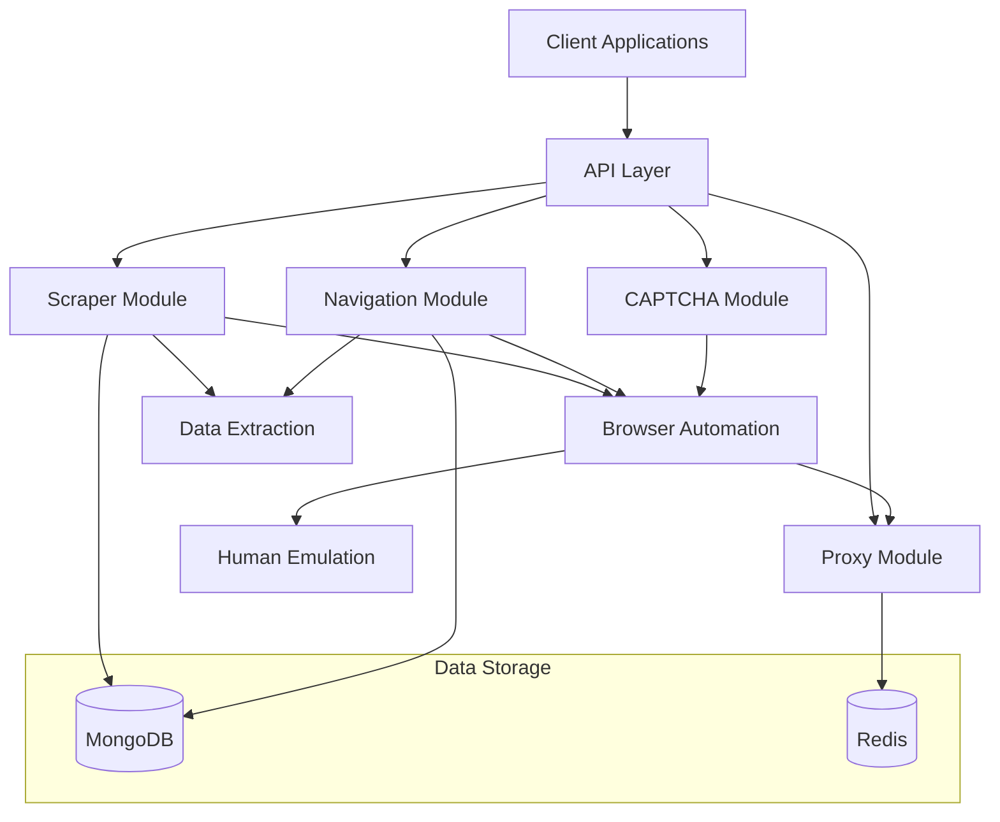

# System Patterns: Advanced Web Scraper API

## System Architecture

The Advanced Web Scraper API follows a modular monolith architecture with clear boundaries between components. This approach provides the benefits of a microservices architecture (separation of concerns, independent development) while avoiding the complexity of distributed systems during initial development.

### High-Level Architecture



### Component Relationships

The system is organized into several key components with well-defined interfaces:

1. **API Layer**
   - Handles HTTP requests and responses
   - Manages authentication and authorization
   - Implements rate limiting and request validation
   - Routes requests to appropriate modules

2. **Scraper Module**
   - Coordinates the scraping process
   - Manages browser instances
   - Handles data extraction and transformation
   - Stores results in the database

3. **Navigation Module**
   - Implements multi-step navigation flows
   - Manages state during navigation
   - Handles pagination and crawling
   - Executes conditional logic

4. **CAPTCHA Module**
   - Detects various types of CAPTCHAs
   - Implements solving strategies
   - Integrates with external solving services
   - Manages token application

5. **Proxy Module**
   - Manages a pool of proxies
   - Implements rotation strategies
   - Monitors proxy health and performance
   - Handles authentication and session management

6. **Browser Automation**
   - Controls browser instances
   - Manages browser contexts and pages
   - Implements stealth techniques
   - Handles resource optimization

7. **Human Emulation**
   - Simulates human-like behavior
   - Implements realistic mouse movements
   - Creates variable timing patterns
   - Adds randomization to interactions

8. **Data Extraction**
   - Implements various selector strategies
   - Extracts structured data from pages
   - Transforms and cleans extracted data
   - Validates against schemas

## Implemented Design Patterns

The system has implemented several design patterns to achieve flexibility, maintainability, and extensibility:

### Singleton Pattern

The Singleton pattern has been implemented for resource managers:

```typescript
// Example from BrowserPool implementation
export class BrowserPool {
  private static instance: BrowserPool;
  private browsers: Map<string, BrowserInstance> = new Map();
  
  private constructor() {
    // Initialize pool
  }
  
  public static getInstance(): BrowserPool {
    if (!BrowserPool.instance) {
      BrowserPool.instance = new BrowserPool();
    }
    return BrowserPool.instance;
  }
  
  // Methods for browser management
}
```

This pattern is applied to:
- Browser pool management (implemented)
- Proxy pool management (implemented)
- Configuration management (implemented)

### Strategy Pattern

The Strategy pattern has been implemented for components with multiple implementation options:

```typescript
// Example from CAPTCHA solving implementation
export enum CaptchaType {
  RECAPTCHA_V2 = 'recaptcha_v2',
  RECAPTCHA_V3 = 'recaptcha_v3',
  HCAPTCHA = 'hcaptcha',
  IMAGE_CAPTCHA = 'image_captcha',
  CLOUDFLARE = 'cloudflare',
  UNKNOWN = 'unknown',
}

// Different solving strategies based on CAPTCHA type
switch (detection.type) {
  case CaptchaType.RECAPTCHA_V2:
    solvingPromise = this.solveRecaptchaV2(detection.siteKey, detection.selector, options);
    break;
  case CaptchaType.RECAPTCHA_V3:
    solvingPromise = this.solveRecaptchaV3(detection.siteKey, options);
    break;
  // Other strategies...
}
```

This pattern is applied to:
- CAPTCHA solving strategies (implemented)
- Proxy rotation strategies (implemented)
- Human behavior profiles (implemented)

### Factory Pattern

The Factory pattern is used for creating complex objects:

```typescript
// Example from browser context creation
public async createContext(
  browser: Browser,
  options: BrowserOptions = {}
): Promise<BrowserContext> {
  // Create and configure a browser context
  const contextOptions = {
    viewport: options.viewport || config.browser.defaultOptions.defaultViewport,
    userAgent: options.userAgent,
    proxy: options.proxy,
  };

  const context = await browser.newContext(contextOptions);
  return context;
}
```

This pattern is applied to:
- Browser and context creation (implemented)
- Proxy instance creation (implemented)

### Command Pattern

The Command pattern is used for navigation steps:

```typescript
// Example from navigation engine
interface NavigationStep {
  type: 'goto' | 'click' | 'input' | 'wait' | 'extract' | 'condition' | 'paginate';
  selector?: string;
  value?: string | number;
  waitFor?: string | number;
  // Other properties...
}

// Execute different steps based on type
switch (step.type) {
  case 'goto':
    await this.executeGotoStep(step);
    break;
  case 'click':
    await this.executeClickStep(step);
    break;
  // Other step types...
}
```

This pattern is applied to:
- Navigation steps (implemented)
- Extraction operations (in progress)

## Critical Implementation Paths

### Browser Automation with Human Emulation

The browser automation module with human emulation has been implemented:

```typescript
// Get a browser from the pool
const browserPool = BrowserPool.getInstance();
const browser = await browserPool.getBrowser();

// Create a context with specific options
const context = await browserPool.createContext(browser, {
  viewport: { width: 1920, height: 1080 },
});

// Create a page and navigate
const page = await context.newPage();
await page.goto(url);

// Use human emulation for interactions
const behaviorEmulator = new BehaviorEmulator(page);
await behaviorEmulator.moveMouseToElement('#search-button');
await behaviorEmulator.clickElement('#search-button');
await behaviorEmulator.typeText('search query', { mistakes: true });

// Release resources
browserPool.releaseBrowser(browser);
```

### CAPTCHA Detection and Solving

The CAPTCHA detection and solving framework has been implemented:

```typescript
// Detect CAPTCHA
const detection = await CaptchaDetector.detect(page);

if (detection.detected) {
  console.log(`Detected ${detection.type} CAPTCHA`);
  
  // Solve the CAPTCHA
  const captchaSolver = new CaptchaSolver(page);
  const result = await captchaSolver.solve({
    useExternalService: true,
    timeout: 60000,
  });
  
  if (result.success) {
    console.log('CAPTCHA solved successfully');
  }
}
```

### Multi-step Navigation

The navigation engine for multi-step flows has been implemented:

```typescript
// Create navigation engine
const navigationEngine = new NavigationEngine(page, {
  timeout: 30000,
  solveCaptcha: true,
});

// Define navigation steps
const steps = [
  {
    type: 'input',
    selector: '#search-input',
    value: 'search term',
    humanInput: true,
  },
  {
    type: 'click',
    selector: '#search-button',
    waitFor: '.results-container',
  },
  {
    type: 'extract',
    name: 'searchResults',
    selector: '.result-item',
    fields: {
      title: '.result-title',
      url: '.result-link@href',
    },
  },
];

// Execute the navigation flow
const result = await navigationEngine.executeFlow(
  'https://example.com/search',
  steps,
  { initialContext: 'data' }
);
```

### Proxy Management

The proxy management system has been implemented:

```typescript
// Get a proxy with specific options
const proxyManager = ProxyManager.getInstance();
const proxy = await proxyManager.getProxy({
  country: 'US',
  type: 'http',
  session: 'session1',
});

// Report proxy result
proxyManager.reportProxyResult(proxy, true, 250); // success, response time

// Get proxy statistics
const stats = proxyManager.getProxyStats();
console.log(`Healthy proxies: ${stats.healthy}/${stats.total}`);
```

## Component Interfaces

### Browser Automation Interface

The browser automation interface has been implemented:

```typescript
// Browser pool interface
export class BrowserPool {
  public static getInstance(): BrowserPool;
  public async getBrowser(options?: BrowserOptions): Promise<Browser>;
  public async createContext(browser: Browser, options?: BrowserOptions): Promise<BrowserContext>;
  public releaseBrowser(browser: Browser): void;
  public async closeAll(): Promise<void>;
}

// Browser options interface
export interface BrowserOptions {
  browserType?: BrowserType;
  headless?: boolean;
  args?: string[];
  proxy?: {
    server: string;
    username?: string;
    password?: string;
  };
  userAgent?: string;
  viewport?: {
    width: number;
    height: number;
  };
}
```

### Human Emulation Interface

The human emulation interface has been implemented:

```typescript
// Human behavior emulator interface
export class BehaviorEmulator {
  constructor(page: Page, options?: HumanEmulationOptions);
  public async moveMouseToElement(selector: string): Promise<void>;
  public async moveMouseToPosition(x: number, y: number): Promise<void>;
  public async clickElement(selector: string): Promise<void>;
  public async typeText(text: string, options?: { mistakes?: boolean; variableSpeed?: boolean }): Promise<void>;
  public async scroll(direction: 'up' | 'down', distance?: number): Promise<void>;
  public async think(): Promise<void>;
}

// Human emulation options interface
export interface HumanEmulationOptions {
  profile?: 'fast' | 'average' | 'careful';
  mouseMovements?: boolean;
  scrolling?: boolean;
  typing?: boolean;
  typoRate?: number;
}
```

### CAPTCHA Solving Interface

The CAPTCHA solving interface has been implemented:

```typescript
// CAPTCHA detector interface
export class CaptchaDetector {
  public static async detect(page: Page): Promise<CaptchaDetectionResult>;
}

// CAPTCHA detection result interface
export interface CaptchaDetectionResult {
  detected: boolean;
  type: CaptchaType | null;
  siteKey?: string;
  selector?: string;
  iframe?: string;
  confidence: number;
}

// CAPTCHA solver interface
export class CaptchaSolver {
  constructor(page: Page);
  public async solve(options?: CaptchaSolveOptions): Promise<CaptchaSolveResult>;
}

// CAPTCHA solve options interface
export interface CaptchaSolveOptions {
  timeout?: number;
  useExternalService?: boolean;
  service?: 'twocaptcha' | 'anticaptcha';
  humanEmulation?: boolean;
}
```

### Navigation Interface

The navigation interface has been implemented:

```typescript
// Navigation engine interface
export class NavigationEngine {
  constructor(page: Page, options?: NavigationOptions);
  public async executeFlow(
    startUrl: string,
    steps: NavigationStep[],
    initialContext?: NavigationContext
  ): Promise<NavigationResult>;
}

// Navigation step interface
export interface NavigationStep {
  type: 'goto' | 'click' | 'input' | 'select' | 'wait' | 'extract' | 'condition' | 'paginate';
  selector?: string;
  value?: string | number;
  waitFor?: string | number;
  timeout?: number;
  // Other step-specific properties
}

// Navigation result interface
export interface NavigationResult {
  id: string;
  startUrl: string;
  status: 'completed' | 'failed';
  stepsExecuted: number;
  result?: any;
  error?: string;
  timestamp: string;
}
```

### Proxy Management Interface

The proxy management interface has been implemented:

```typescript
// Proxy manager interface
export class ProxyManager {
  public static getInstance(): ProxyManager;
  public async getProxy(options?: ProxyOptions): Promise<ProxyInfo | null>;
  public reportProxyResult(proxy: ProxyInfo, success: boolean, responseTime?: number): void;
  public getProxyCount(): number;
  public getHealthyProxyCount(): number;
  public getProxyStats(): { total: number; healthy: number; countries: string[]; types: string[] };
}

// Proxy options interface
export interface ProxyOptions {
  country?: string;
  type?: 'http' | 'https' | 'socks4' | 'socks5';
  session?: string;
  rotating?: boolean;
}

// Proxy info interface
export interface ProxyInfo {
  host: string;
  port: number;
  type: 'http' | 'https' | 'socks4' | 'socks5';
  username?: string;
  password?: string;
  country?: string;
  responseTime?: number;
  successRate?: number;
  lastUsed?: string;
}
```

## Error Handling

The error handling system has been implemented:

```typescript
// Custom error class
export class ApiError extends Error {
  statusCode: number;
  isOperational: boolean;

  constructor(statusCode: number, message: string, isOperational = true, stack = '') {
    super(message);
    this.statusCode = statusCode;
    this.isOperational = isOperational;
    
    if (stack) {
      this.stack = stack;
    } else {
      Error.captureStackTrace(this, this.constructor);
    }
  }
}

// Error handler middleware
export const errorHandler = (
  err: Error | ApiError,
  req: Request,
  res: Response,
  next: NextFunction
) => {
  // Default error values
  let statusCode = 500;
  let message = 'Internal Server Error';
  let isOperational = false;

  // Handle ApiError instances
  if (err instanceof ApiError) {
    statusCode = err.statusCode;
    message = err.message;
    isOperational = err.isOperational;
  } else if (err.name === 'ValidationError') {
    // Handle validation errors
    statusCode = 400;
    message = err.message;
    isOperational = true;
  }

  // Log the error
  if (isOperational) {
    logger.warn(`Operational error: ${message}`);
  } else {
    logger.error(`Unexpected error: ${err.message}`, { stack: err.stack });
  }

  // Send response
  res.status(statusCode).json({
    status: 'error',
    message,
    ...(process.env.NODE_ENV === 'development' && { stack: err.stack }),
  });
};

// Async handler to catch errors in async route handlers
export const asyncHandler = (fn: (req: Request, res: Response, next: NextFunction) => Promise<any>) => {
  return (req: Request, res: Response, next: NextFunction) => {
    Promise.resolve(fn(req, res, next)).catch(next);
  };
};
```

### Data Extraction Interface

The data extraction interface has been implemented:

```typescript
// Extraction engine interface
export class ExtractionEngine {
  constructor();
  public async extract(config: ExtractionConfig): Promise<ExtractionResult>;
}

// Extraction configuration interface
export interface ExtractionConfig {
  url?: string;
  fields: FieldConfig;
  pagination?: PaginationConfig;
  validation?: ValidationConfig;
  options?: ExtractionOptions;
}

// Field configuration interface
export interface FieldConfig {
  [fieldName: string]: SelectorConfig | NestedExtractionConfig;
}

// Selector configuration interfaces
export interface SelectorConfig {
  type: SelectorType;
  name: string;
  selector: string;
  attribute?: string;
  multiple?: boolean;
  transform?: string | ((value: any, context?: any) => any);
  dataType?: string;
  required?: boolean;
  defaultValue?: any;
}

// Extraction result interface
export interface ExtractionResult {
  id: string;
  url: string;
  status: 'completed' | 'failed' | 'partial';
  data: any;
  error?: string;
  stats?: {
    startTime: string;
    endTime: string;
    duration: number;
    pagesProcessed: number;
    itemsExtracted: number;
  };
  timestamp: string;
}
```

### Selector Strategy Pattern

The selector strategy pattern has been implemented for data extraction:

```typescript
// Selector strategy interface
export interface SelectorStrategy {
  canHandle(config: SelectorConfig): boolean;
  extract(page: Page, config: SelectorConfig, context: any): Promise<any>;
}

// CSS selector strategy
export class CssSelectorStrategy implements SelectorStrategy {
  public canHandle(config: SelectorConfig): boolean {
    return config.type === SelectorType.CSS;
  }

  public async extract(page: Page, config: SelectorConfig, context: any): Promise<any> {
    // Implementation for CSS selector extraction
    // Supports multiple selector patterns:
    // 1. Wildcard class matching: [class*="partial-name"]
    // 2. Data attribute selectors: [data-test^='propertyCard-']
    // 3. Content-based selectors: :contains('text')
    // 4. Structural relationships: :has(>span)
    // 5. Multiple fallback selectors (comma separated)
  }
}

// XPath selector strategy
export class XPathSelectorStrategy implements SelectorStrategy {
  public canHandle(config: SelectorConfig): boolean {
    return config.type === SelectorType.XPATH;
  }

  public async extract(page: Page, config: SelectorConfig, context: any): Promise<any> {
    // Implementation for XPath selector extraction
  }
}

// Regex selector strategy
export class RegexSelectorStrategy implements SelectorStrategy {
  public canHandle(config: SelectorConfig): boolean {
    return config.type === SelectorType.REGEX;
  }

  public async extract(page: Page, config: SelectorConfig, context: any): Promise<any> {
    // Implementation for regex selector extraction
  }
}

// Function selector strategy
export class FunctionSelectorStrategy implements SelectorStrategy {
  public canHandle(config: SelectorConfig): boolean {
    return config.type === SelectorType.FUNCTION;
  }

  public async extract(page: Page, config: SelectorConfig, context: any): Promise<any> {
    // Implementation for function selector extraction
  }
}
```

## Next Implementation Steps

1. **Storage Adapters**
   - Implement storage adapters for different destinations
   - Create adapters for file system, database, and API endpoints
   - Develop transformation pipeline for data export
   - Build caching mechanisms for improved performance

2. **API Completion**
   - Add request validation with JSON schema
   - Implement response formatting and pagination
   - Add rate limiting and request throttling
   - Create webhook notifications for async operations
   - Enhance error reporting and monitoring

3. **Testing and Validation**
   - Implement unit tests for core components
   - Create integration tests for API endpoints
   - Develop end-to-end tests for complete flows
   - Measure performance and detection avoidance success

4. **Documentation**
   - Complete API documentation with examples
   - Create usage guides for common scenarios
   - Develop integration tutorials
   - Document best practices for avoiding detection

*Note: This document will be updated as implementation progresses and new patterns emerge.*
